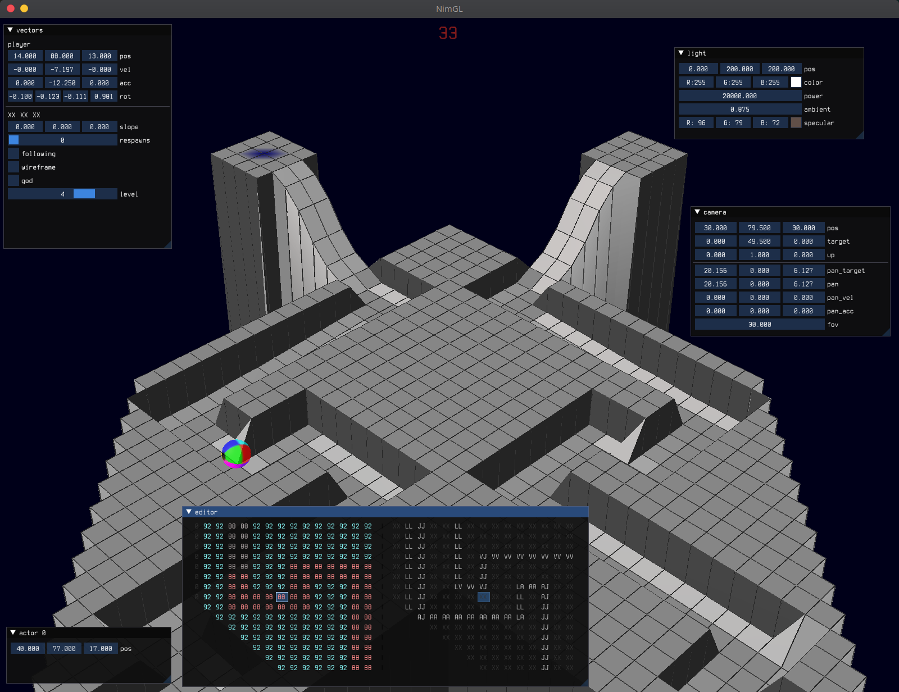

# Nimarble

It's a marble game modeled after a classic from the arcade era. Works with
touchpad and trackball, untested but possibly impractical with a mouse.

## Screenshot



## Development

It uses `nimgl` and requires `cimgui` to be installed or present in current
directory.

- Build:

    ```
    nimble build
    ```

- Run

    ```
    ./nimarble
    ```

## Usage

It's largely keyboard-driven. Use `L` to toggle between controlling the marble
and normal mouse mode.

| Key          | Action            |
|--------------|-------------------|
| Up           | pan_up            |
| Down         | pan_down          |
| Left         | pan_left          |
| Right        | pan_right         |
| PageUp       | pan_in            |
| PageDown     | pan_out           |
| Home         | pan_ccw           |
| End          | pan_cw            |
| `[`          | prev_level        |
| `]`          | next_level        |
| `L`          | toggle_mouse_lock |
| `P`          | pause             |
| `S`          | step_frame        |
| `F`          | follow            |
| `W`          | toggle_wireframe  |
| `G`          | toggle_god        |
| `X`          | respawn           |
| `R`          | do_reset_player   |
| `E`          | focus_editor      |
| `Q`          | do_quit           |

Editor keymap:

| Key          | Action            |
|--------------|-------------------|
| Escape       | back              |
| Tab          | toggle_cursor     |
| Up           | cursor N          |
| Down         | cursor S          |
| Left         | cursor W          |
| Right        | cursor E          |
| PageUp       | cursor NW         |
| PageDown     | cursor SE         |
| Home         | cursor SW         |
| End          | cursor NE         |
| `-`          | dec               |
| `=`/`+`      | inc               |
| `0` .. `9`   | set_number        |
| `.`          | decimal point     |
| `B`          | toggle_brush      |
| BS/Delete    | delete            |
| `X`          | set_mask XX       |
| `C`          | set_mask IC       |
| `U`          | set_mask CU       |
| `L`          | set_mask LL       |
| `V`          | set_mask VV       |
| `A`          | set_mask AA       |
| `J`          | set_mask JJ       |
| `I`          | set_mask II       |
| `H`          | set_mask HH       |
| `R`          | set_mask RH       |
| `G`          | set_mask GG       |
| `S`          | set_mask SW       |
| `P`          | set_mask P1       |
| `M`          | set_mask EM       |
| `Y`          | set_mask EY       |
| `T`          | set_mask TU       |
| `N`          | set_mask IN       |
| `O`          | set_mask OU       |
| `W`          | save              |
| `E`          | leave             |

## Level structure

A level is comprised of layers comprising the height map which is just a grid of
floating point numbers, and a mask which defines the attributes of each point
such as entity start points, surface type, or whether there is a cliff.

Levels are stored as TSV files making spreadsheet interoperability relatively
straightforward. Generally each level will have two TSV files which are arranged
with each row's starting column increasing every row, which enables what I call
the "vertical is diagonal" perspective of the playing field.

## Masks

| Mask                | Description                       |
|---------------------|-----------------------------------|
| `XX`                | none / regular slope              |
| `LL`                | `L` is left                       |
| `JJ`                | `J` is right                      |
| `AA`                | `A` is up                         |
| `VV`                | `V` is down                       |
| `HH`                | `H` is left and right             |
| `II`                | `I` is top and bottom             |
| `LA` `AJ` `LV` `VJ` | corners combine two orthogonals   |
| `AH` `VH` `IL` `IJ` | all but one active edge           |
| `IH`                | oops! all cliffs                  |
| `RI` `RH`           | ramps up/down, left/right         |
| `GG`                | goal                              |
| `TU` `IN` `OU`      | tubes                             |
| `IC`                | icy                               |
| `CU`                | copper                            |
| `SW`                | sine wave                         |
| `P1`                | player 1 start position           |
| `P2`                | player 2 start position           |
| `EM`                | entity: marble                    |
| `EY`                | entity: yum                       |
| `EA`                | entity: acid                      |
| `EV`                | entity: vacuum                    |
| `EP`                | entity: piston                    |
| `EH`                | entity: hammer                    |
